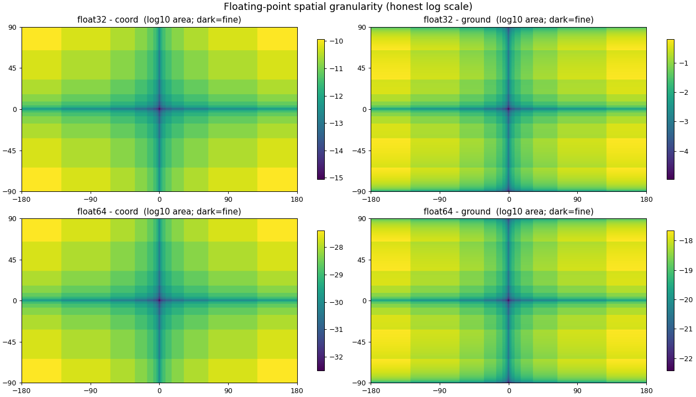

# Floating-Point Spatial Granularity

How finely can you pin down a location on Earth when its latitude/longitude is
stored as a 32- or 64-bit IEEE-754 float?

A float's **ULP** (the gap to the next representable value) grows in discrete
**powers of two** as the magnitude grows. So the smallest distinguishable "cell"
around a coordinate — the rectangle spanned by

```
(lat, lon), (nextafter(lat), lon), (nextafter(lat), nextafter(lon)), (lat, nextafter(lon))
```

— varies enormously across the globe, and does so in a striking **tartan / plaid**
pattern rather than a smooth gradient.



## What you're looking at

- `ulp(lat)` depends only on `|lat|`, jumping at **|lat| = 1, 2, 4, 8, 16, 32, 64°**
  → horizontal stripes.
- `ulp(lon)` depends only on `|lon|`, jumping at **|lon| = 1, 2, 4, …, 128°**
  → vertical stripes.
- Stripes **double in width** outward, so fine lines bunch up near the axes and
  big blocks dominate near the edges.
- **Null Island (0, 0)** is the single finest point; a dark "+" of fine values
  runs along the **equator** and **prime meridian**; the four corners
  (poles × antimeridian) are coarsest. Everything is mirror-symmetric about both
  axes because ULP depends only on magnitude.

## Two metrics (`--metric`)

| metric            | formula                                   | poles |
|-------------------|-------------------------------------------|-------|
| `ground` (default)| `Δlat_m × Δlon_m`, with `Δlon_m ∝ cos(lat)` (m²) | collapse to ~0 (meridians converge) |
| `coord`           | `ulp(lat) × ulp(lon)` (deg²)              | stay coarse (pure float precision) |

`ground` is the real patch of Earth you can resolve; `coord` isolates the
floating-point story without map geometry. Flip between them to see the
`cos(lat)` pole effect appear/disappear.

## Usage

```bash
python3 -m venv .venv
./.venv/bin/pip install -r requirements.txt

# both precisions, ground metric (default) -> docs/
./.venv/bin/python granularity.py

# options
./.venv/bin/python granularity.py --precision 32 --metric coord
./.venv/bin/python granularity.py --width 4000 --height 2600 --opacity 0.45
```

Outputs land in `docs/`:

- `index.html` — landing page linking the two maps
- `float32.html`, `float64.html` — self-contained Leaflet maps (PNG embedded as
  a data URI, so no external assets). The overlay is rendered in **Web Mercator**
  so it lines up with the basemap; a labels/boundaries layer sits *above* the
  heatmap, and there's a log color legend plus an info box
- `granularity_float{32,64}_{metric}.png` — the raw overlay images

## Hosting on GitHub Pages

The `docs/` directory is self-contained. In the repo settings, set
**Pages → Source → Deploy from a branch → `main` / `/docs`**, and the maps are live.

## A note on the finest cells

What sets a cell's size is the **ULP (spacing) at that coordinate**, not the
magnitude floor of the format. Near a value `x`, the spacing is roughly
`x · 2⁻²³` for float32 (~7 significant digits), shrinking toward the subnormal
floor `2⁻¹⁴⁹ ≈ 1.4e-45°` (≈ `1.6e-40 m`, below the Planck length) right at
Null Island. So `(0,0)` is genuinely sub-atomic.

| coordinate | float32 ULP | ground spacing |
|---|---|---|
| lat 40° (mid-US) | `2⁻¹⁸ ≈ 3.8e-6°` | ~42 cm |
| lat 0.1°         | `2⁻²⁷ ≈ 7.5e-9°` | ~0.83 mm |
| lat 1e-6°        | `2⁻⁴³`           | ~13 nm |
| lat → 0          | `2⁻¹⁴⁹`          | ~1.6e-40 m |

The color scale uses the **true** min/max of the sampled grid (no clipping), so
the deep wells along the axes show honestly. The exact center is a measure-zero
line a raster can't capture, so the displayed minimum is bounded by
`--width`/`--height`; crank them to push the well deeper. Latitude metres use a
constant 111.32 km/deg (the equator-to-pole variation is <1%, invisible on a log
scale).
